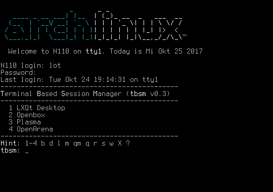

_tbsm_ is an application or session launcher, written in pure bash with no
ncurses or dialog dependencies. He is inspired by _cdm_, _tdm_, in some way by
_krunner_ and related.

It was attempted to design the behavior of _tbsm_ to be as less pesky as
possible, and to start daily tasks with as less key strokes.

Furthermore is there the possibility to customize his look by themes.

### Last version is 0.5, released Dez 2018

#### Release Notes

    857fca4 - Add support for Wayland sessions
              Thanks to Ian for this very welcome patch

Older release notes [are here](https://raw.githubusercontent.com/loh-tar/tbsm/master/doc/80_ChangeLog.txt).

The full changelog [is there](https://github.com/loh-tar/tbsm/commits/master).

### Screenshots

These shots are here to give you an idea what you will get.

#### tbsm with tulizu

That's how my login screen looks after a while with an issue file of
[tulizu](https://loh-tar.github.io/tulizu/) and the default _tbsm_ theme.

#### gently theme after a while giving a hint

#### austere theme after _return_ with quick menue

#### riddler theme

### Install

#### Packages

Arch users find it in [AUR](https://aur.archlinux.org/packages/tbsm/)

#### From Source

_cd_ into the downloaded source tree and simply run:

    sudo make install

To remove, which you will of cause never do, run:

    sudo make uninstall

### Post Install Tasks

To auto start _tbsm_ after login edit your _~/.bash_profile_, or similar, and
append to the end something like:

    # Auto start tbsm after login on first two VTs
    [[ $XDG_VTNR -le 2 ]] && tbsm

NOTE: Ensure you start no other display manager

And it may wise to run:

    tbsm doc man
    tbsm help

### License

GNU General Public License (GPL), Version 2.0
